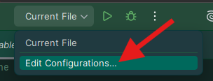
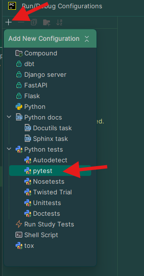
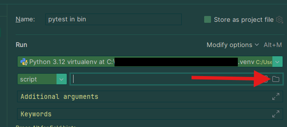
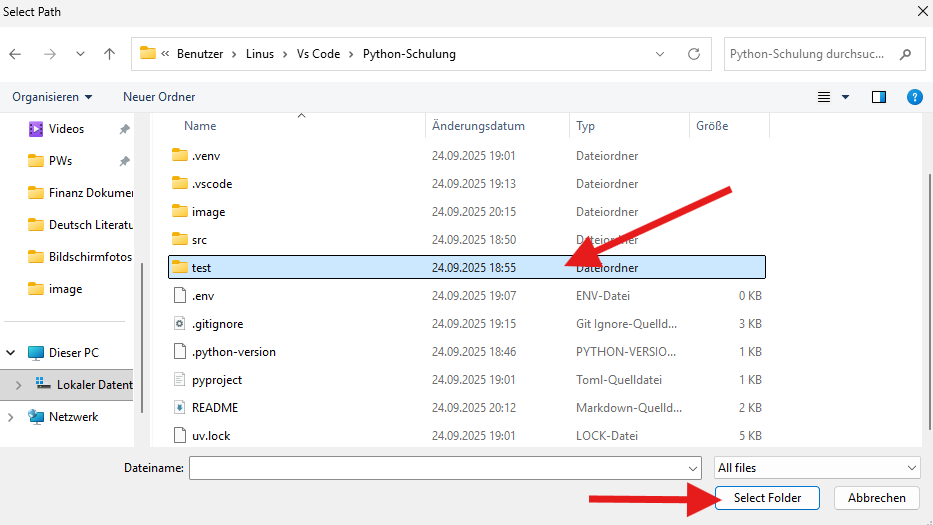
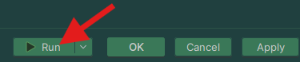

## Installtionsanleitung

### Schritt 1 - Repository clonen:
Clone das Repository indem du einen der folgenden Befehle ausführst:
- HTTPS:
````bash
git clone https://github.com/CL1nu5/Python-Schulung.git
````
- SSH:
````bash
git clone git@github.com:CL1nu5/Python-Schulung.git
````

> [!NOTE]
> Achte dabei daruaf, dass du dich mit der console in dem Ordner befindes, in dem du auch dein Repository benutzen möchtest

### Schritt 2 - Repository in PyCharm öffnen:
- Solltest du dich noch in einem geöffneten Projekt befinden gelangst du über "Menü(≡) -> File -> Close Project" zurück ins Hauptmenü
- Drücke im Haupt Menü auf "open" und wähle das geclonte Repository über den File-Dialog aus.

## Bedienungsanleitung

### Grundlegendes Konpezt
Die Übungen sind in 3 Teile unterteilt. Die Tatsächlichen Aufgaben befinden sich hier: [Aufgaben](src/aufgaben/). Die Aufgaben sind jeweils in Kapitel unterteilt und entsprechend benannt. Die Lösungen zu den jeweiligen Aufgaben befinden sich hier: [Lösungen](src/l%C3%B6sungen/). Hier besteht die gleiche Unterordnerstruktur der Aufgaben. Zusätzlich zu den Lösungen gibt es als dritten Teil die Möglichkeit seinen Code per Tests automatisch prüfen zu lassen. Dadurch könnt ihr den Code checken, ohne von den Lösungen eventuelle Spoiler zu bekommen. 

### Hinweisen zu den Tests
Anfangs sollten alle Tests ersteinmal fehlschlagen. Für jede Aufgabe die erfolgreich gelößt wird, läuft der dafür entsprechende Test anschließend bei erneutem ausführen grün.

### Ausführen der Automatischen Tests

1. Estelle eine neue run Konfiguration



2. Klicke auf das "+" und wähle pytest aus



3. Clicke auf den Filedialog um den Testordner auszuwählen



4. Wähle den Testordner ("test") des Repositorys aus und clicke auf "Selct Folder"



5. Führe die Tests aus




